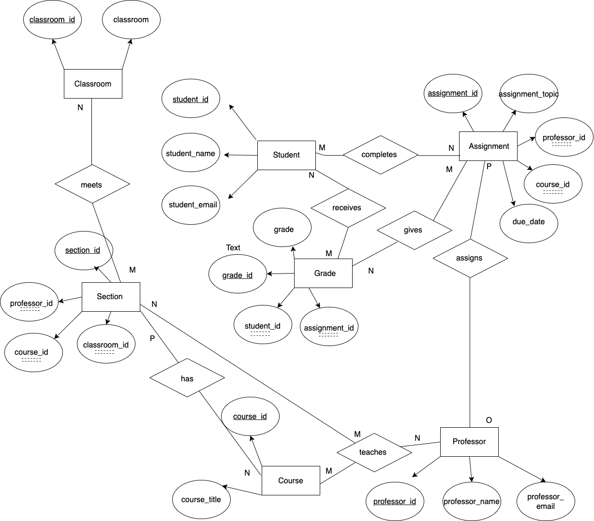

# Data Normalization and Entity-Relationship Diagramming
An assignment to normalize the structure of data and establish a set of Entity-Relationship Diagrams for the data.

## Original Data Set
The following table illustrates the first few rows of the original data set.
| assignment_id | student_id | due_date | professor | assignment_topic                | classroom | grade | relevant_reading    | professor_email   |
| :------------ | :--------- | :------- | :-------- | :------------------------------ | :-------- | :---- | :------------------ | :---------------- |
| 1             | 1          | 23.02.21 | Melvin    | Data normalization              | WWH 101   | 80    | Deumlich Chapter 3  | l.melvin@foo.edu  |
| 2             | 7          | 18.11.21 | Logston   | Single table queries            | 60FA 314  | 25    | Dümmlers Chapter 11 | e.logston@foo.edu |
| 1             | 4          | 23.02.21 | Melvin    | Data normalization              | WWH 101   | 75    | Deumlich Chapter 3  | l.melvin@foo.edu  |
| 5             | 2          | 05.05.21 | Logston   | Python and pandas               | 60FA 314  | 92    | Dümmlers Chapter 14 | e.logston@foo.edu |
| 4             | 2          | 04.07.21 | Nevarez   | Spreadsheet aggregate functions | WWH 201   | 65    | Zehnder Page 87     | i.nevarez@foo.edu |
| ...           | ...        | ...      | ...       | ...                             | ...       | ...   | ...                 | ...               |

### Normal Forms
- **First Normal Form:** Satisfied. The table has a fixed schema and all values are singular.
- **Second Normal Form:** Not Satisfied. This dataset has a composite primary key composed of `student_id`and `assigment_id`. The table's non-key fields, specifically `due_date` and `assignment_topic`, are facts about `assignment_id` only, not about the `assignment_id / student_id` combined entity. Thus, this table doesn't meet the requirements of 2NF.
- **Third Normal Form:** Not Satisfied. Firstly, we reject 3NF because 2NF is not satisfied. Additionally, 3NF is not satisfied because this example demonstrates a non key field, like `professor_email`, as a fact of another non-key field, like `professor`.
- **Fourth Normal Form:** Not Satisfied. 3NF not satisfied, so 4NF will also not be satisfied. According to the 4NF, there cannot be more than one independent multi-valued fact field, however this is violated because, for instance, a professor can have multiple sections at varied classrooms with distinct readings or assignments. 

## Convert to 4NF
### Table 1: Students
This table contains the primary key `student_id` and non-key fields `student_name` and `student_email`.
| student_id | student_name        | student_email     |
|------------|---------------------|-------------------|
| 1          | Daniella Tuesta     | dt2211@foo.edu    |
| 2          | Lily Gladstone      | lg3013@foo.edu    |
| 3          | Jane Doe            | jd3490@foo.edu    |
| ...        | ...                 | ...               |

### Table 2: Professors
This table contains the primary key `professor_id` and non-key fields `professor_name` and `professor_email`.
| professor_id | professor_name      | professor_email   |
|--------------|---------------------|-------------------|
| 1            | Martin Melvin       | mm1234@foo.edu    |
| 2            | Neil Nevarez        | nn3042@foo.edu    |
| 3            | Bob Bloomberg       | bb0941@foo.edu    |
| ...          | ...                 | ...               |

### Table 3: Courses
This table contains the primary key `course_id` and non-key fields `course_title` and `professor_email`.
| course_id | course_title                             | 
|-----------|------------------------------------------|
| CS101     | Introduction to Computer Science         | 
| CS102     | Data Structures                          |
| CS002     | Introduction to Computer Programming     | 
| ...       | ...                                      | 

### Table 4: Classrooms
| classroom_id | classroom      | 
|--------------|----------------|
| 1            | WWH 101        |
| 2            | WWH 102        |
| 3            | WWH 103        |
| ...          | ...            |

### Table 5: Sections
| section_id | course_id    | professor_id  | classroom_id  |
|------------|--------------|---------------|---------------|
| 1          | CS101        | 4             | 5             |
| 2          | CS102        | 1             | 5             |
| 3          | CS002        | 3             | 3             |
| ...        | ...          | ...           | ...           |

### Table 6: Assignment
| assignment_id | course_id | professor_id  | assignment_topic | due_date |
|---------------|-----------|---------------|------------------|----------|
| 1             | CS101     | 4             | Python           | 02-14-24 |
| 2             | CS102     | 3             | Data Munging     | 03-24-24 |
| 3             | CS002     | 3             | Strings          | 03-26-24 |
| ...           | ...       | ...           | ...              | ...      |

### Table 7: Grades
| grade_id | student_id | assignment_id | grade  |
|----------|------------|---------------|--------|
| 1        | 4          | 2             | 50     |
| 2        | 6          | 2             | 85     |
| 3        | 3          | 1             | 75     |
| ...      | ...        | ...           | ...    |

## Entity-Relationship Diagram

### Changes made
- Firstly, I made separate tables for information related to students, professors, courses, and classrooms. In each of these tables the primary key is `tabletitle_id` and the non-key fields are values that provide information about the entity, like a name for students and professors, a title for a course, and a specific room for a classroom.
- Moving on, I created a sections table containing the foreign keys `course_id`,`professor_id`,and `classroom_id`. The primary key is the unique `section_id` aimed to individually identify a class section. This table links courses, professors, and classrooms to a specific section. 
- Table 6 contains the foreign keys `course_id` and `professor_id`. The primary key is the unique `assignment_id` and non-key fields are additional information pertaining to the assignment. This table ensures the independence of assignments from student or professor specific details, as shown in the original dataset.
- Table 7 shows grades with the primary key `grade_id` and the foreign keys `student_id` and `assignment_id` to connect information about the student and assignment from other tables.

